# [Maratona de Programação 2019 - A](https://judge.beecrowd.com/pt/problems/view/2962)


<p align="center">
  <a href='https://ko-fi.com/O4O8VXU7D' target='_blank'></a>
</p>

Vídeo com a explicação

[](https://youtube.com/watch?v=FJ92-D6qhKQ "Maratona 2019 - A - Arte Valiosa")

Para ver a descrição do problema visite o link no título

---

${toc}

## Complexidade

**Tempo:** $O(K^2)$

**Espaço:** $O(K)$

## Primeiros passos

Para entender o problema primeiramente vamos pensar no que significa ser ou não
possível roubar a pintura. Podemos imaginar a configuração da sala com a porta
em que o ladrão entra, e local do quadro.

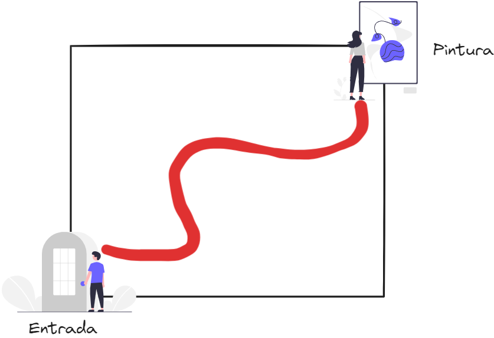 

Para que o ladrão não consiga chegar até a pintura é preciso interroper o caminho
do ladrão até a pintura, isso significa que precisamos colocar os sensores na
sala de forma que eles conectem a parede da esquerda com a de baixo, a parede
da esquerda com a da direita, a parede de cima com a de baixo, ou a parede de
cima com a da direita.

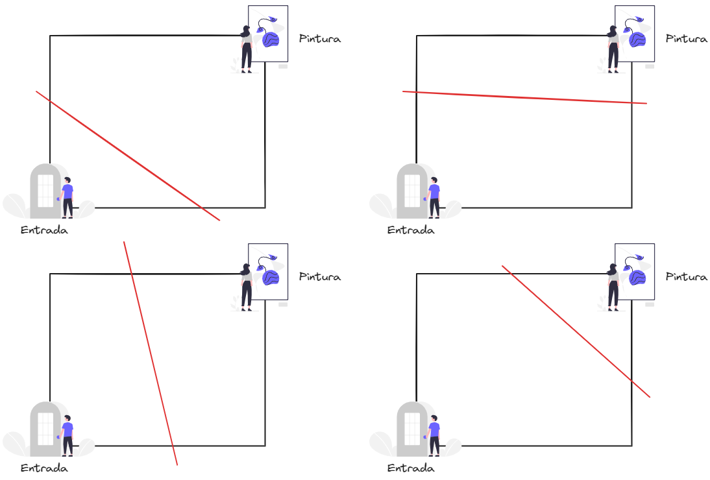 

Podemos ver um exemplo disso na imagem a seguir onde o raio de detecção do
sensor os conectam um a um até que todo o caminho de uma parede a outra estejam
conectados.

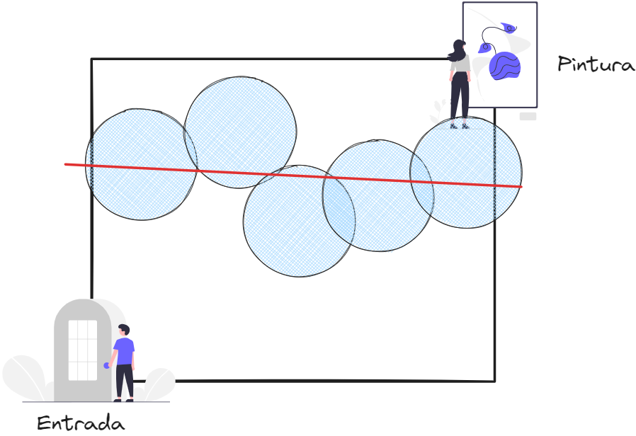 

Para conectar de forma eficiente um sensor no outro, vamos utilizar a estrutura
de dados Union-Find, também conhecida como Disjoint Sets.

## Union-Find

O Union Find é uma estrutura de dados que serve para acompanhar conjuntos distintos.
Essa estrutura suporta realizar duas operações de forma eficiente:

- **Union:** Unir dois conjuntos distintos em um só.
- **Find:** Encontrar a qual conjunto um elemento pertence.

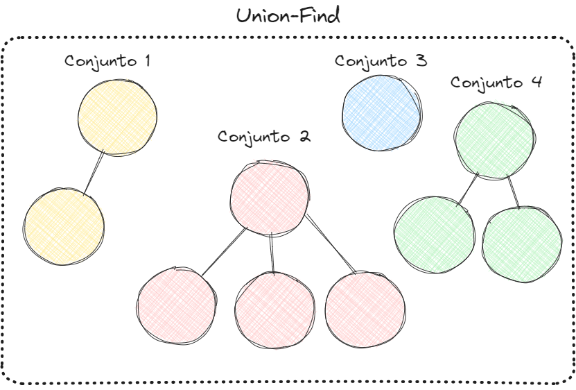

### Implementação do Union-Find

Cada conjunto dentro da estrutura é representado por um único elemento. Cada
elemento possui um elemento pai, e o elemento pai na raíz é o representante do
conjunto. Na imagem a seguir, o conjunto dos nós em vermelhos é representado
pelo número 4, temos também que 4 é pai de 2, 2 é pai de 1, e 1 é pai de 9.

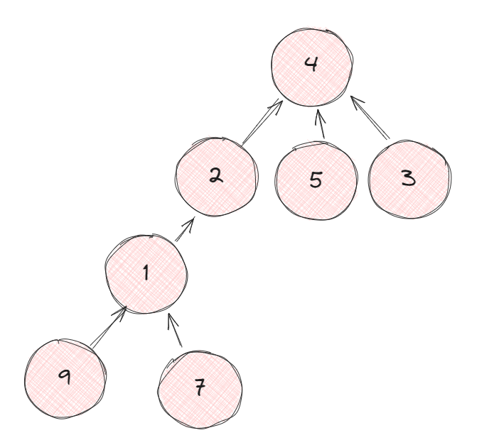

Além do cojunto ter o elemento pai, cada número tem um valor de `rank` que é um
limite superior para a altura da árvore. O rank é utilizado para tentar minimizar
a altura da arvore ao unir dois conjuntos.

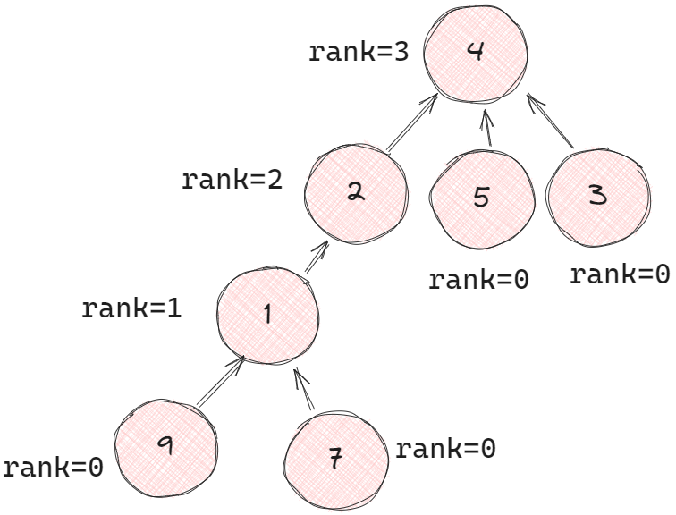

#### Find

Agora que nós temos a informação para cada nó, e para o conjunto todo nós podemos
implementar a função que retorna a qual conjunto um item pertence. Para fazer
isso nós simplesmente subimos a árvore até encontrar a raiz. Se na árvore da imagem
nós tentarmos encontrar o conjunto do nó $7$, nós encontramos o elemento pai
dele $1$, e o pai do pai $2$, e por fim $4$ que é o elemento raiz. Isso nós diz
que o $7$ está no conjunto representado pelo $4$. Verificar se os elementos $3$ e
$7$ estão no mesmo conjunto significa então verificar se os dois estão no conjunto
representado pelo $4$.


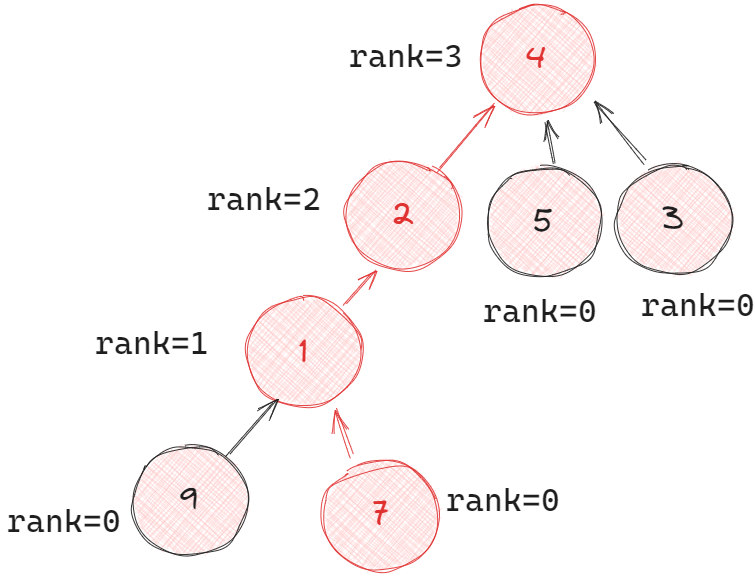

Como nós percorremos todos os elementos $7$, $1$, $2$, e $4$, nós sabemos que
todos eles são representados pelo $4$, uma otimização que nós podemos fazer agora
é conectar todos eles diretamente ao $4$ para reduzir a próxima busca. Dessa forma
se eu buscar o conjunto em que o $1$ pertence, eu já sei que ele pertence ao
conjunto representado por $4$, e se eu buscar em que conjunto o $9$ pertence,
eu só preciso passar pelo $1$ antes de saber que ele pertence ao conjunto $4$.
Essa otimização se chama **Path Compression**


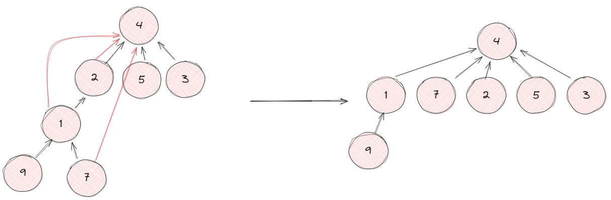

#### Union

Para unir dois conjuntos nós primeiro encontramos o elemento que representa cada
um dos conjuntos usando o algritimo descrito em **Find**. Feito isso nós
verificamos qual deles contem o maior `rank`, o item de menor `rank` passa a ter
como pai o item de maior `rank` unindo as duas árvores.


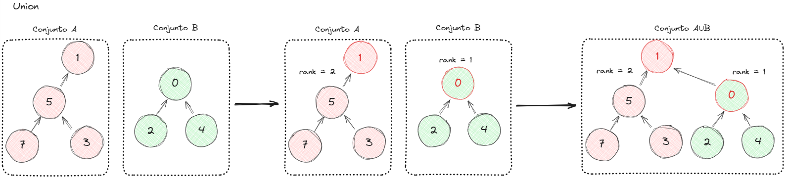

Note que ao conectar os conjuntos no exemplo, o `rank` dos nós não mudou. Isso
não aconteceria se nós conectassemos a raiz de $A$ em $B$, o que faria com que
a raiz de $B$ tivesse um rank de 3, e resultaria em uma árvore mais profunda, o
que é pior para busca.


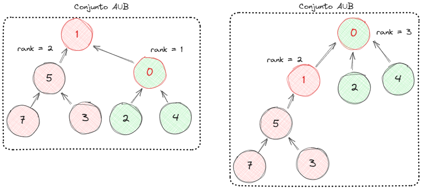


Caso ambas as raizes tenham o mesmo `rank`, não importa a ordem em que elas se
juntam, porém, é preciso incrementar o `rank` da árvore que foi escolhida para
representar o conjunto.


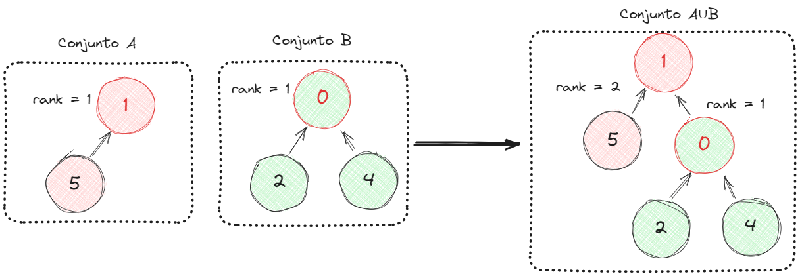

#### Connected

Para conveniência também podemos implementar uma função `connected(i, j)` que
verifica se $i$ e $j$ estão conectados. Para isso, basta verificar se
`find(i) == find(j)`

## O Problema

Podemos começar a modelar o problema criando um elemeto para cada uma das 
paredes da sala.

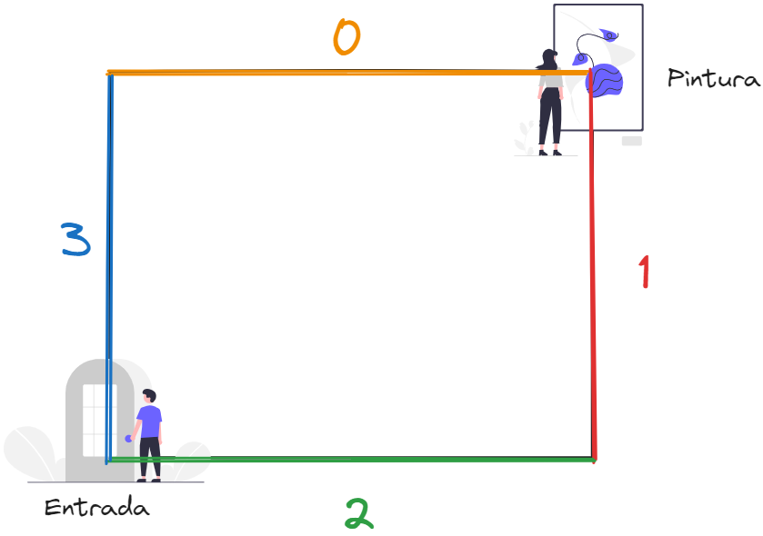

Cada vez que eu adiciono um sensor também, eu adiciono ele se torna um elemento
no nosso Union-Find. Ao adicionar um sensor eu posso ver se ele detecta a parede,
caso sim, eu posso unir o conjunto do sensor com a parede.

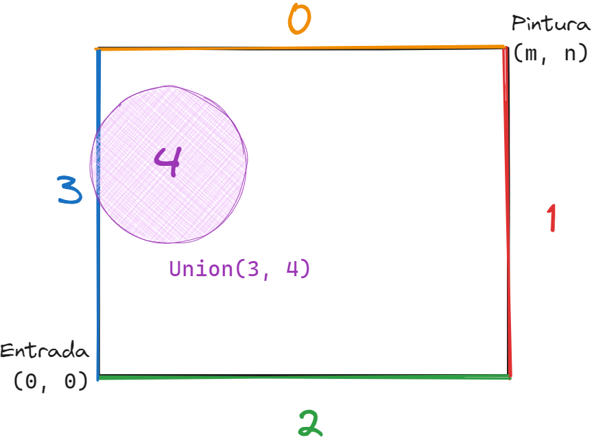

Para verificar se o sensor detecta a parede, podemos olhar para as coordenadas
$(x, y)$ do centro do círculo, e o raio $r$. Se:

- $y + r \ge n$. O sensor detecta a parede $0$.
- $x + r \ge m$. O sensor detecta a parede $1$.
- $y - r \le 0$. O sensor detecta a parede $2$.
- $x - r \le 0$. O sensor detecta a parede $3$.

Uma vez adicionados todos os sensores podemos verificar quais sensores se conectam.
Para isso, podemos verificar todos os pares de sensores se existe uma interceção
entre eles. Considerando as posições $P_1$, e $P_2$ dos sensores, e os seus raios
$r_1$, e $r_2$, vais existir uma interceção entre eles se:

$$dist(P_1, P_2) \le r_1 + r_2$$


Podemos ver isso na figura a seguir:


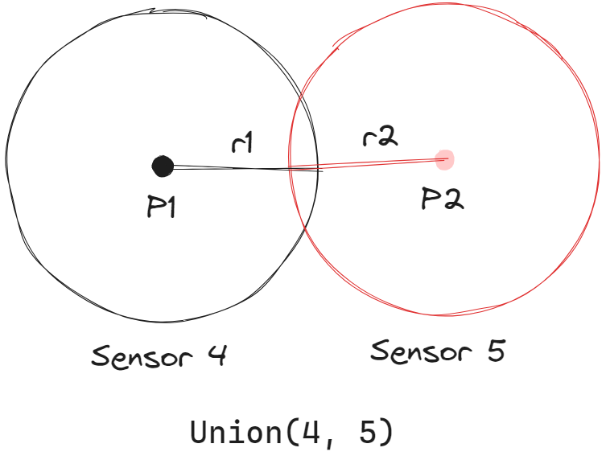

Uma vez que fizemos isso para todos os sensores, podemos usar o Union-Find para
verificar se as paredes $(0, 1)$, $(0, 2)$, $(3, 1)$ ou $(3, 2)$ estão conectadas.
Se sim, é impossível roubar a pintura.

## Implementação

Implementações da solução em Python, C++, e Rust.

### Python
```Python
from sys import stdin
from math import dist


class UnionFind:
    def __init__(self, n: int) -> None:
        self.rank = [0] * n
        self.parent = [i for i in range(n)]

    def find(self, n: int) -> int:
        # Comprime o caminho para o elemento pai
        if n != self.parent[n]:
            self.parent[n] = self.find(self.parent[n])
        return self.parent[n]
    
    def union(self, a: int, b: int) -> None:
        root_a = self.find(a)
        root_b = self.find(b)

        if self.rank[root_a] > self.rank[root_b]:
            self.parent[root_b] = root_a

        elif self.rank[root_b] > self.rank[root_a]:
            self.parent[root_a] = root_b

        else:
            self.parent[root_b] = root_a
            self.rank[root_a] += 1

    def connected(self, a: int, b: int) -> bool:
        return self.find(a) == self.find(b)


def main():
    m, n, k = map(int, stdin.readline().split())
    # Nós 0, 1, 2, e 3 são reservados respectivamente para o topo, a direita
    # em baixo, e a esquerda.
    union_find = UnionFind(k + 4)

    sensors = [None] * k
    for i, line in enumerate(stdin.readlines()):
        x, y, s = map(int, line.split())
        sensors[i] = (x, y, s) # type: ignore

        # Sensor enxerga a parede do topo
        if y + s >= n:
            union_find.union(0, i + 4)
        # Sensor encerga a parede da direita
        if x + s >= m:
            union_find.union(1, i + 4)
        # Sensor enxerga a parede de baixo
        if y - s <= 0:
            union_find.union(2, i + 4)
        # Sensor enxerga a parede da esquerda
        if x - s <= 0:
            union_find.union(3, i + 4)


    for i, (x1, y1, s1) in enumerate(sensors): # type: ignore
        for j, (x2, y2, s2) in enumerate(sensors[i+1:]): # type: ignore
            if dist((x1, y1), (x2, y2)) <= s1 + s2:
                idx_i = i + 4
                idx_j = i + j + 5

                union_find.union(idx_i, idx_j)


    if union_find.connected(0, 1) or union_find.connected(0, 2) or \
       union_find.connected(3, 1) or union_find.connected(3, 2):
        print("N")
    else:
        print("S")
 


if __name__ == "__main__":
    main()
```

### C++
```C++
#include <cstdio>
#include <cmath>


class UnionFind {
    int parent[1004];
    int rank[1004];
public:
    UnionFind(int n) {
        for (int i = 0; i < n; i++){
            parent[i] = i;
            rank[i] = 1;
        }
    }

    int find(int n) {
        if (parent[n] != n) {
            parent[n] = find(parent[n]);
        }
        return parent[n];
    }

    void merge(int a, int b) {
        int parent_a = find(a);
        int parent_b = find(b);

        if (rank[parent_a] > rank[parent_b]) {
            parent[parent_b] = parent_a;
        } else if (rank[parent_a] < rank[parent_b]) {
            parent[parent_a] = parent_b; 
        } else {
            parent[parent_b] = parent_a;
            rank[parent_a]++;
        }
    }

    bool connected(int a, int b) {
        return find(a) == find(b);
    }
};


double dist(int p1[3], int p2[3]) {
    return sqrt(
        (p1[0] - p2[0]) * (p1[0] - p2[0]) +
        (p1[1] - p2[1]) * (p1[1] - p2[1])
    );
}


int main (int argc, char *argv[]) {
    int m, n, k;
    int sensors[1000][3];

    scanf("%d %d %d", &m, &n, &k);
    /* Nós 0, 1, 2, e 3 são reservados para o topo, a direita, em baixo, e a
     * esquerda respectivamente. */
    auto union_find = UnionFind(k + 4);

    for (int i = 0; i < k; i++){
        scanf("%d %d %d", &sensors[i][0], &sensors[i][1], &sensors[i][2]);

        // Sensor encherga a parede do topo
        if (sensors[i][1] + sensors[i][2] >= n)
            union_find.merge(0, i + 4);

        // Sensor encherga a parede da direita
        if (sensors[i][0] + sensors[i][2] >= m)
            union_find.merge(1, i + 4);

        // Sensor encherga a parede de baixo
        if (sensors[i][1] - sensors[i][2] <= 0)
            union_find.merge(2, i + 4);

        // Sensor encherga a parede da esquerda
        if (sensors[i][0] - sensors[i][2] <= 0)
            union_find.merge(3, i + 4);
    }

    for (int i = 0; i < k; i++) {
        for (int j = i + 1; j < k; j++){
            if (dist(sensors[i], sensors[j]) <= sensors[i][2] + sensors[j][2])
                union_find.merge(i + 4, j + 4);
        }
    }

    if (union_find.connected(0, 1) || union_find.connected(0, 2) ||
        union_find.connected(3, 1) || union_find.connected(3, 2))
        printf("N\n");
    else
        printf("S\n");

    return 0;
}
```

### Rust

```Rust
use std::error::Error;
use std::cmp::Ordering;
use std::io;

#[derive(Debug)]
struct UnionFind {
    parent: Vec<usize>,
    rank: Vec<usize>,
}

impl UnionFind {
    pub fn new(n: usize) -> Self {
        UnionFind {
            parent: (0..n).into_iter().collect(),
            rank: vec![0; n],
        }
    }

    pub fn find(&mut self, n: usize) -> Option<usize> {
        match self.parent.get(n) {
            Some(&value) => {
                if n != value {
                    self.parent[n] = self.find(value)?;
                }
                self.parent.get(n).copied()
            }
            None => None
        }
    }

    pub fn union(&mut self, a: usize, b: usize) -> Result<(), String> {
        let parent_a = self.find(a).expect("Could not find `a`");
        let parent_b = self.find(b).expect("Could not find `b`");

        let rank_a = self.rank[parent_a];
        let rank_b = self.rank[parent_b];

        match rank_a.cmp(&rank_b) {
            Ordering::Greater => {
                self.parent[parent_b] = parent_a;
            },
            Ordering::Less => {
                self.parent[parent_a] = parent_b;
            },
            Ordering::Equal => {
                self.parent[parent_b] = parent_a;
                self.rank[parent_a] += 1;
            }
        }

        Ok(())
    }

    pub fn connected(&mut self, a: usize, b: usize) -> Result<bool, String> {
        let parent_a = self.find(a).expect("Could not find `a`");
        let parent_b = self.find(b).expect("Could not find `b`");

        return Ok(parent_a == parent_b);
    }
}

fn parse_line(line: Result<String, io::Error>) -> (i64, i64, i64) {
    match line {
        Err(e) => panic!("Error reading line: {}", e),
        Ok(line) => {
            let values: Vec<_> = line
                .split_whitespace()
                .map(|x| {
                    x.parse()
                        .expect("Input should only contain non-negative Integers")
                })
                .collect();

            (values[0], values[1], values[2])
        }
    }
}

fn dist(p1: &[i64], p2: &[i64]) -> f64 {
    (((p1[0] - p2[0]) * (p1[0] - p2[0]) + (p1[1] - p2[1]) * (p1[1] - p2[1])) as f64).sqrt()
}

fn main() -> Result<(), Box<dyn Error>> {
    let mut lines = io::stdin().lines();
    let (m, n, k) = parse_line(lines.next().expect("Input cannot be empty"));
    let mut union_find = UnionFind::new((k + 4) as usize);
    let mut sensors = vec![vec![0; 3]; k as usize];

    for (i, line) in lines.enumerate() {
        (sensors[i][0], sensors[i][1], sensors[i][2]) = parse_line(line);

        // Sensor encherga a parede de cima
        if sensors[i][1] + sensors[i][2] >= n {
            union_find.union(0, i + 4)?;
        }

        // Sensor encherga a parede da direita
        if sensors[i][0] + sensors[i][2] >= m {
            union_find.union(1, i + 4)?;
        }

        // Sensor encherga a parede de baixo
        if sensors[i][1] - sensors[i][2] <= 0 {
            union_find.union(2, i + 4)?;
        }

        // Sensor encherga a parede da esquerda
        if sensors[i][0] - sensors[i][2] <= 0 {
            union_find.union(3, i + 4)?;
        }
    }

    for (i, sensor_i) in sensors.iter().enumerate() {
        for (j, sensor_j) in sensors.iter().enumerate().skip(i + 1) {
            if dist(sensor_i, sensor_j) <= (sensor_i[2] + sensor_j[2]) as f64 {
                union_find.union(i + 4, j + 4)?;
            }
        }
    }

    if union_find.connected(0, 1)?
        || union_find.connected(0, 2)?
        || union_find.connected(3, 1)?
        || union_find.connected(3, 2)?
    {
        println!("N");
    } else {
        println!("S");
    }
    Ok(())
}
```
