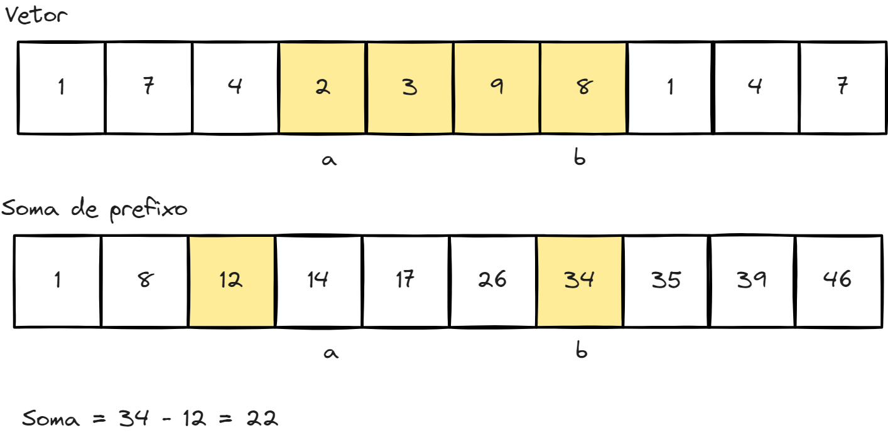
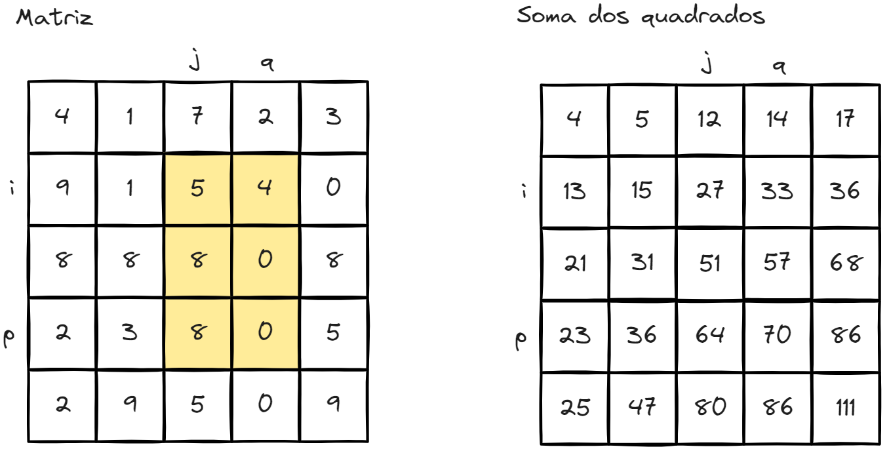
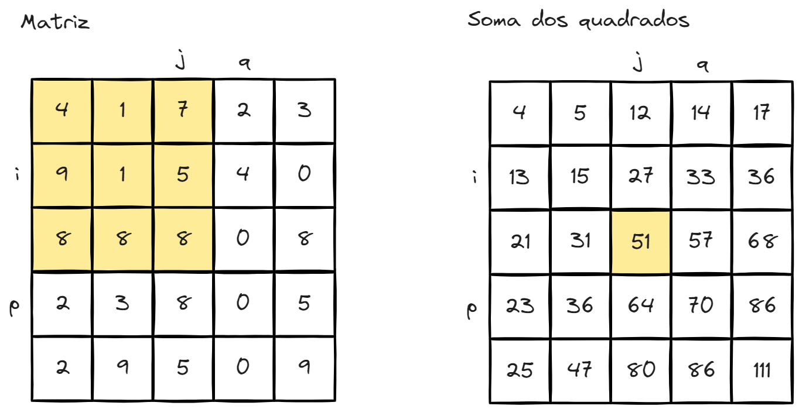
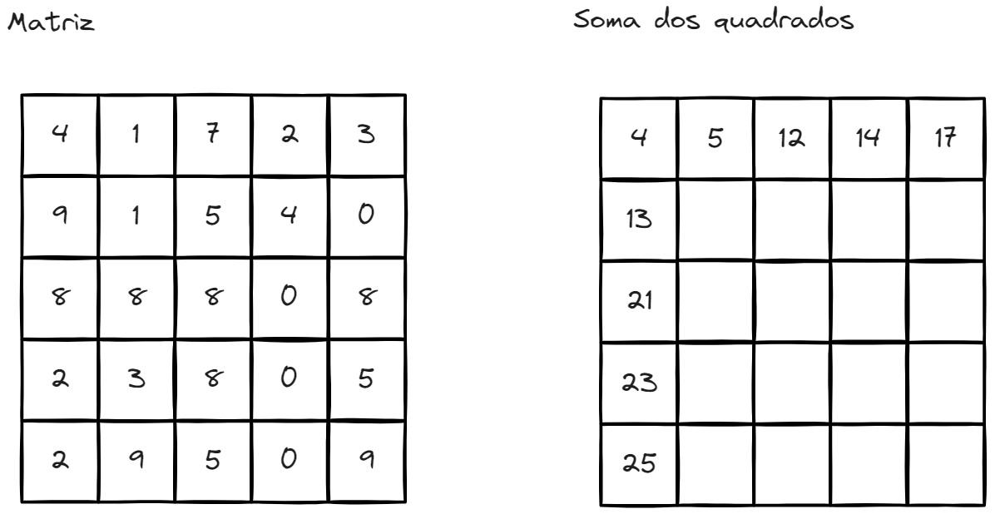
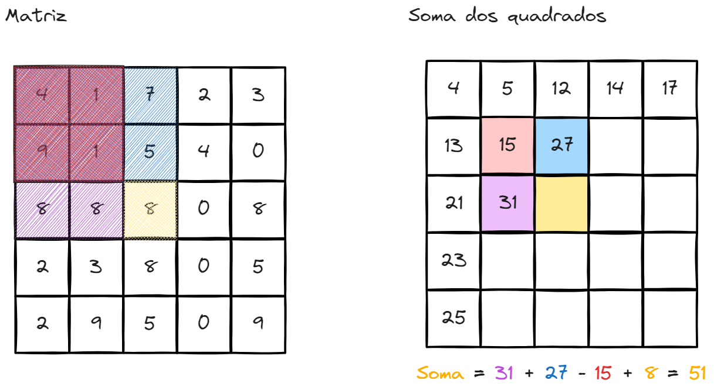
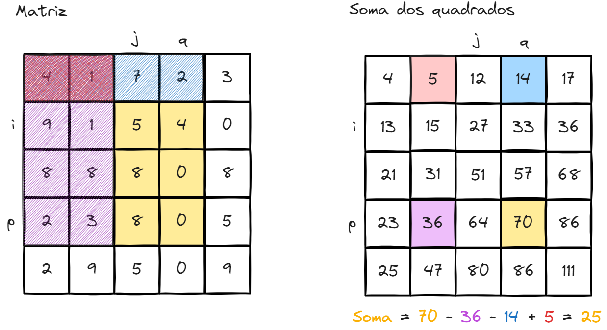
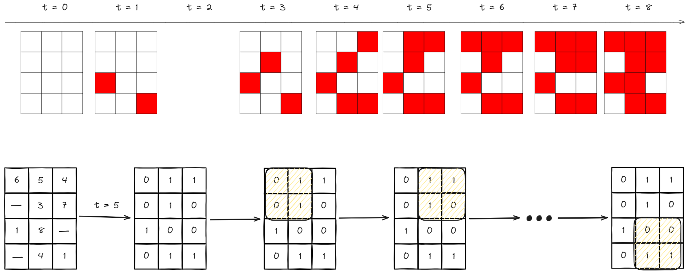

# [Maratona Mineira de programação 2022 - D](https://codeforces.com/group/YgJmumGtHD/contest/103794/problem/D)

<p align="center">
  <a href='https://ko-fi.com/O4O8VXU7D' target='_blank'></a>
</p>

Vídeo com a explicação

[](https://www.youtube.com/watch?v=Emt1w2h9Aq0 "Maratona Mineira 2022 - D")

Para ver a descrição do problema visite o link no título

## Complexidade

**Tempo:** $O(\log(D) \cdot N \cdot M)$

**Espaço:** $O(M \cdot N)$

## O Exemplo

Para desenvolver a solução vamos começar com o exemplo:

```text
4 3 2 9
1 1 6
1 2 5
4 2 4
3 1 1
1 3 4
2 2 3
3 2 8
2 3 7
4 3 1
```

Podemos visualizar o exemplo com a linha do tempo a seguir. Onde cada quadrado
representa uma cidade, e os quadrados em vermelho representam as cidades em
alerta de emergência.


## Primeiros passos

O segredo para resolver este problema é perceber que este é um problema de **BUSCA,**
onde se busca encontrar o tempo em que se busca encontrar o momento em que o país
entrou em colapso. E que tempo é uma variável ordenada. Dessa forma, podemos fazer
uma **Busca Binária** para encontrar o momento certo.

## Busca binária

Imagine que nós temos uma função `esta_em_colapso(pais, t)` que retorna verdadeiro
se o país está em colapso no instante `t` e falso caso o contrário. Considere agora
que avaliamos essa função em $t = 0$ e vemos que o país ainda não está em colapso.
Avaliamos também a função em $t = 100$ e vemos que o país está em colapso. Sabemos
que em algum momento $0 \lt t \le 100$ o país entrou em colapso. Podemos usar isso
para avaliar buscar de forma eficiente o instante em que o país entrou em colapso.

Considere os extremos, $t_{min} \le t \le t_{max}$. Nós podemos avaliar o país
em um instante no meio dos extremos $t' = \lfloor(t_{max} - t_{min}) / 2\rfloor$
, dessa forma se o país já entrou em colapso, reduzimos a nossa busca para 
$t_{min} \le t \le t'$ já, e se o país ainda não entrou em colapso reduzimos a
busca para $t'\lt t \le t_{max}$. De todo o caso, reduzimos o espaço de busca
na metade. Podemos repetir o processo até encontrar o instante onde 
$t_{min} \ge t_{max}$ onde nós sabemos que encontramos o resultado da busca.

Como a cada etapa nós reduzimos o espaço de busca na metado, sabemos que esse
algoritimo leva no máximo $\log_2 t_{max}$ para encontrar a solução. O intervalo
de tempo no problema é de $1 \le D \le 10^9$, sabemos que esse algorítimo vai
encontrar a resposta em no máximo 34 iterações.

## Verificando se o país entrou em colapso

O nosso algoritimo de busca requer que nós tenhamos uma função 
`esta_em_colapso(pais, t)` que verifica se esse país entro ou não em colapso.
Como essa função vai ser executada em cada iteração da busca, ela precisa ser
implementado de forma eficiente.

Verificar se o país entrou em colapso significa verificar se existe algum quadrado
$K \times K$ em que todos as cidades estão em colapso. Isso pode ser feito,
verificando se para cada quadrado $K \times K$ no país, a soma das cidades dentro
do quadrado que entraram em colapso é igual a $K^2$. Não é possível para cada
quadrado $K \times K$ somar os $K^2$ elementos dentro dele para fazer essa
verificação, pois isso demoraria de mais. Para conferir a soma dentro do quadrado
de forma eficiente vamos usar uma matriz de soma de prefixos.

### O que é a matriz de soma de prefixos?

Considere que você quer saber a soma dos elementos entre os índices $a$, e $b$
de um vetor. Nós podemos armazenar um vetor onde cada elemento $k_i$ do vetor
armazena a soma de todos os números até o i-ésimo número. Utilizando esse vetor
podemos sabemos que a soma de todos os números entre $b$ e $a$ é dada por
$k_b - k_{a-1}$ como na figura a seguir. Se nós estamos fazendo muitas
consultas no vetor, computar a soma do prefixo torna a consulta muito
mais eficiente.



Podemos extender a ideia de vetores para matrizes. Considere que queremos saber
a soma dos elementos de uma matriz no retângulo definito pelo canto superior
esquerdo $a_{i, j}$ e o canto inferior direito $a_{p, q}$.



Podemos criar uma matriz de soma de prefixos onde cada elemento $a_{i, j}$ da
matriz armazena a soma de todos os números do retângulo definido pelo canto
superior esquerdo $a_{0, 0}$ e o canto inferior direito $a_{i, j}$. Podemos
usar essa matriz de soma de prefixos para recuperar de forma eficiente a soma
desejada.




### Construindo a matriz de soma de prefixos

Para construir a matriz para a soma de prefixos, nós começamos preenchendo a
primeira linhna, e a primeira coluna. Esses casos são simples pois são similares
a versão em 1D do problema.



Agora nós podemos preencher os outros valores da matriz. Suponha que nós 
queremos saber a soma de todos os elementos entre $a_{0, 0}$ e $a_{i, j}$. Nós
podemos utilizar a soma de todos os elementos entre $a_{0, 0}$ e $a_{i-1, j}$,
e a soma dos elementos entre $a_{0, 0}$ e $a_{i, j-1}$. Somando esses dois
valores nós somamos todos os números do intervalo que desejamos, a não ser o
número $a_{i, j}$, porém, ao somar esses números nós somamos duas vezes os
números do intervalo até $a_{i-1, j-1}$, nós podemos então subtrair estes
valores da matriz, e adicionar o valor de $a_{i, j}$.



Considerando então uma matriz $A$, e uma matriz de soma de prefixos $P$, onde
cada elemento $p_{i, j}$ representa a soma dos elementos de $A$ do retangulo
definido por $a_{0, 0}$ e $a_{i, j}$ nós sabemos que:

$$p_{i, j} = a_{i, j} + p_{i-1, j} + p_{i, j-1} - p_{i-1,j-1}$$

### Recuperando a soma da matriz de soma de prefixos

Agora que nós temos a matriz de soma de prefixos, nós podemos recuperar de forma
eficiente a soma dos elementos dentro do retângulo definido $a_{i, j}$ e $a_{p, q}$
para isso podemos ver que se subtrairmos de $p_{p, q}$ os valores $p_{p, j}$ e
$p_{i, q}$ nós subtraimos todos os valores que não fazem parte do intervalo, porém,
nós subtraimos o intervalo $p_{i, j}$ duas vezes, assim, precisamos adicionar ele
de volta.



No final, a soma dos números no intervalo $a_{i, j}$ a $a_{p, q}$ é dada por:

$$p_{p, q} - p_{p, j} - p_{i, q} + p_{i, j}$$

### Verificando se o país entrou em colapso

Agora para verificar se um país entrou ou não em colapso, podemos armazenar o
horário em que a cidade entrou em estado de emergência em uma matriz. Assim,
podemos converter essa matriz para uma matriz de 0 ou 1 dizendo se a cidade
entrou ou não em estado de emergência no tempo em desejado. Podemos assim
verificar a soma em cada quadrado $K \times K$ dentro da matriz que representa
o país. Isso pode ser feito de forma eficiente utilizando a soma de prefixos.
Se, para algum dos quadrados, a soma dos valores é $K^2$ o país entrou em colapso.

 


## Implementação

Implementações da solução em Python e C++.

### Python
```Python
import sys

MAX = 1000000001

def fill_prefix_sum(country: list[list[int]], t: int) -> list[list[int]]:
    n, m = len(country), len(country[0])
    prefix_sum = [[0 for _ in range(m)] for _ in range(n)]

    prefix_sum[0][0] = int(country[0][0] <= t)

    for i in range(1, n):
        prefix_sum[i][0] = prefix_sum[i-1][0] + int(country[i][0] <= t)

    for j in range(1, m):
        prefix_sum[0][j] = prefix_sum[0][j-1] + int(country[0][j] <= t)

    for i in range(1, n):
        for j in range(1, m):
            prefix_sum[i][j] = int(country[i][j] <= t) + \
                                prefix_sum[i-1][j] + \
                                prefix_sum[i][j-1] - \
                                prefix_sum[i-1][j-1]
    return prefix_sum


def get_sum(prefix_sum: list[list[int]], i: int, j: int, window_size: int) -> int:
    top, left = i - window_size, j - window_size
    sum = prefix_sum[i][j]

    if top >= 0:
        sum -= prefix_sum[top][j]

    if left >= 0:
        sum -= prefix_sum[i][left]

    if top >= 0 and left >= 0:
        sum += prefix_sum[top][left]

    return sum


def is_collapsed(country: list[list[int]], t: int, window_size: int) -> bool:
    n, m = len(country), len(country[0])
    window_size_sq = window_size * window_size
    prefix_sum = fill_prefix_sum(country, t)
    for i in range(window_size - 1, n):
        for j in range(window_size - 1, m):
            if get_sum(prefix_sum, i, j, window_size) == window_size_sq:
                return True
    return False


def main():
    # Lendo os inputs
    n, m, k, q = map(int, sys.stdin.readline().split())
    country = [[MAX for _ in range(m)] for _ in range(n)]

    for line in sys.stdin:
        a, b, d = map(int, line.split())
        country[a-1][b-1] = d
    
    # Busca binaria pelo momento em que o pais entrou em colapso
    left, right = 0, MAX
    collapsed = False
    while left < right:
        mid = (right + left) // 2
        if is_collapsed(country, mid, k):
            collapsed = True
            right = mid
        else:
            left = mid + 1

    # Imprime a resposta
    print(right if collapsed else -1)
    

if __name__ == "__main__":
    main()
```

### C++
```C++
#include <algorithm>
#include <cstdio>
#include <cstring>

#define MAX 1e9 + 1  // Valor maximo de tempo
#define MAX_SIDE 401 // Tamanho maximo de um dos lados do quadrado


void fill_prefix_sum(int country[][MAX_SIDE], int prefix_sum[][MAX_SIDE], int t, int n, int m) {
	memset(prefix_sum, 0, MAX_SIDE * MAX_SIDE * sizeof(int));
	
	prefix_sum[0][0] = (country[0][0] <= t);
	for (int row = 1; row < n; row++)
		prefix_sum[row][0] = prefix_sum[row - 1][0] + (country[row][0] <= t);

	for (int col = 1; col < m; col++)
		prefix_sum[0][col] = prefix_sum[0][col - 1] + (country[0][col] <= t);

	for (int row = 1; row < n; row++) {
		for (int col = 1; col < m; col++) {
			prefix_sum[row][col] = (country[row][col] <= t) + 
						prefix_sum[row-1][col] + 
						prefix_sum[row][col-1] - 
						prefix_sum[row-1][col-1];
		}
	}
}

int get_sum(int prefix_sum[][MAX_SIDE], int i, int j, int window_size){
	int top = i - window_size;
	int left = j - window_size;

	int sum = prefix_sum[i][j];
	if (top >= 0)
		sum -= prefix_sum[top][j];
	if (left >= 0)
		sum -= prefix_sum[i][left];
	if (top >= 0 && left >= 0)
		sum += prefix_sum[top][left];

	return sum;
}

bool is_collapsed(int country[][MAX_SIDE], int t, int n, int m, int window_size){
	int prefix_sum[MAX_SIDE][MAX_SIDE];
	fill_prefix_sum(country, prefix_sum, t, n, m);

	int window_sq = window_size * window_size;
	for (int i = window_size - 1; i < n; i++) {
		for (int j = window_size - 1; j < m; j++) {
			if (get_sum(prefix_sum, i, j, window_size) == window_sq)
				return true;
		}
	}

	return false;
}

int main () {
	int n, m, k, q;
	int a, b, d;

	int country[MAX_SIDE][MAX_SIDE];
	std::fill(&country[0][0], &country[0][0] + MAX_SIDE * MAX_SIDE, MAX);

	// Input dos dados
	scanf("%d %d %d %d", &n, &m, &k, &q);
	for (int i = 0; i < q; i++) {
		scanf("%d %d %d", &a, &b, &d);
		country[a-1][b-1] = d;
	}
	

	// Busca binaria pelo momento em que o pais
	// entrou em colapso
	int mid, l = 0, r = MAX;
	bool collapsed = false;
	while (l < r) {
		mid = (r + l) / 2;
		if (is_collapsed(country, mid, n, m, k)){
			collapsed = true;
			r = mid;
		} else {
			l = mid + 1;
		}

	}

	// Imprime a resposta
	printf("%d\n", (collapsed ? r : -1));

	return 0;
}
```
