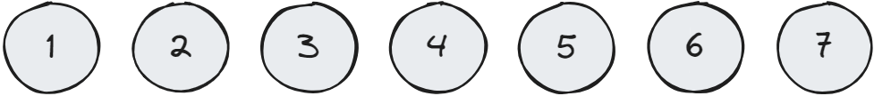

# [Leetcode 368 - Largest Divisible Subset](https://leetcode.com/problems/largest-divisible-subset/description/)


Para ver a descrição do problema visite o link no título

## Complexidade

**Tempo:** $O(n^2)$

**Espaço:** $O(n)$

## O Exemplo

Para desenvolver a solução vamos começar com o exemplo:

```text
nums = [3, 7, 1, 6, 2, 5, 4]
```

Podemos visualizar o exemplo na imagem a seguir:


## Primeiros passos

Primeiramente, é importante perceber que para dois números $p$ e $q$, se $p$ divide $q$ então, necessáriamente $p \le q$. Podemos então começar a resolver o problema ordenando o vetor, dessa forma, precisamos comparar o número apenas com os números menores que eles.




## Encontrando a recursão


Para encontrar a recursão é importante perceber que se existe um número $k$ onde $k$ divide $p$, e $p$ divide $q$, então, $k$ também divide $q$. Suponha então que nós temos um subconjunto onde todos os números dividem $a_j$, se $a_j$ divide $a_i$, então todos os membros desse subconjunto também dividem $a_i$.

Imagine agora uma função que calcula o tamanho do maior subconjunto que inclui o i-ésimo número $a_i$, esse conjunto é 1 maior do que o maior conjunto de um dos divisores de $a_i$. Re-escrevendo, para todo $j$ onde $a_j$ divide $a_i$ temos que $f(i) = \max \left(1 + f(j)\right)$

Para o caso base, podemos pensar que todo número é divisor de si mesmo, então o conjunto deve conter ao menos 1 número.

Agora que temos essa fórmula, podemos iterar por todos os itens da lista. Para cada um deles, verificando os itens anteriores o dividem, e o tamanho do seu conjunto. Vamos fazer isso armazenando o valor de $f(i)$ no vetor `dp_value`. É interessante guardar também o elemento $j$ que maximiza a função para $i$ pois isso vai nos ajudar a reconstruir o conjunto depois, para isso vamos armazenar o valor de $j$ para o elemento $i$ no vetor `dp_pred`.

Utilizando o exemplo, começamos com $i=0$, e $a_0 = 1$, como ele não tem antecessor, sabemos que o maior conjunto até agora contém apenas ele, então, $f(0) = 1$. Como não há nenhum número que antecede ele não faz sentido preencher o valor de `dp_pred`. Após a primeira iteração encontramos o resultado da Imagem:


Para a segunda iteração, com $i=1$ e $a_1 = 2$ encontramos que $a_0 = 1$ divide $2$ e maximiza a função, então armazenamos o valor de $f(1) = 1 + f(0) = 2$ em `dp_value`, e armazenamos o valor de $0$ em `dp_pred` para reconstruir o conjunto depois.


Na quarta iteração com $i = 3$, e $a_3 = 4$, ambos $a_0 = 1$ e $a_1 = 2$ dividem $4$, porém $f(1) > f(0)$ então, para maximizar a função temos que $f(3) = 1 + f(1) = 3$.


Repetimos o algoritimo até o último elemento do input:


## Recriando o conjunto

Conforme nós prenchemos os vetores `dp_value` e `dp_pred`, é possível armazenar o valor de $i$ que maximiza o tamanho do conjunto $f(i)$ na variável `max_set_idx`. O valor máximo de $f(i)$ também pode ser armazenado na variável `max_set_size`. Podemos então criar um vetor `set` de tamanho `max_set_size` que armazene o conjunto que queremos calcular.

Utilizamos uma variável `current_value` para apontar para o índice do elemento que maximiza o conjunto. Preenchemos o vetor `set` com o elemento no índice `current_value`, e atualizamos o valor de `current_value` para o próximo elemento do conjunto utilizando os valores de `dp_pred`.


## Implementação

Implementações da solução em Python, C++ e Rust.

### Python
```Python
class Solution(object):
    def largestDivisibleSubset(self, nums):
        """
        :type nums: List[int]
        :rtype: List[int]
        """
        n = len(nums)
        nums.sort()
        max_set_size = 0
        max_set_idx = 0

        dp_value = [1 for _ in range(n)]
        dp_pred = [0 for _ in range(n)]

        for i, n in enumerate(nums):
            for j, m in enumerate(nums[:i]):
                if n % m == 0 and dp_value[i] < 1 + dp_value[j]:
                    dp_value[i] = 1 + dp_value[j]
                    dp_pred[i] = j

            if dp_value[i] > max_set_size:
                max_set_size = dp_value[i]
                max_set_idx = i

        subset = [0 for _ in range(max_set_size)]
        current_value = max_set_idx
        for i in range(max_set_size):
            subset[i] = nums[current_value]
            current_value = dp_pred[current_value]

        return subset

```

### C++
```C++
#include <vector>
#include <algorithm>

using namespace std;

class Solution {
public:
    vector<int> largestDivisibleSubset(vector<int>& nums) {
        int n = nums.size();
        int max_set_size = 0;
        int max_set_idx = 0;
        vector<int> dp_value = vector<int>(n, 1);
        vector<int> dp_pred  = vector<int>(n);
        
        sort(nums.begin(), nums.end());
        for(int i = 0; i < n; i++) {
            for(int j = 0; j < i; j++) {
                if (nums[i] % nums[j] == 0 && dp_value[i] < 1 + dp_value[j]) {
                    dp_value[i] = 1 + dp_value[j];
                    dp_pred[i] = j;
                }
            }
            if(dp_value[i] > max_set_size) {
                max_set_size = dp_value[i];
                max_set_idx = i;
            }
        }
        
        vector<int> set = vector<int>(max_set_size);
        int current_value = max_set_idx;

        for(int i = 0; i < max_set_size; i++){
            set[i] = nums[current_value];
            current_value = dp_pred[current_value];
        }
        return set;
    }
};
```

### Rust
```Rust
impl Solution {
    pub fn largest_divisible_subset(mut nums: Vec<i32>) -> Vec<i32> {
        let n = nums.len();
        nums.sort_unstable(); 
        let mut max_set_size = 0;
        let mut max_set_idx= 0;

        let mut dp_value = vec![1; n];
        let mut dp_pred= vec![0; n];

        // Computes the largest_divisible_subset
        for (i, &n) in nums.iter().enumerate() {
            for (j, &m) in nums.iter().take(i).enumerate() {
                if (n % m == 0) && (dp_value[i] < 1 + dp_value[j]) {
                    dp_value[i] = 1 + dp_value[j];
                    dp_pred[i] = j;
                }
            }
            if dp_value[i] > max_set_size {
                max_set_size = dp_value[i];
                max_set_idx = i;
            }
        }
        // Reconstruct the set
        let mut set = Vec::with_capacity(max_set_size);
        let mut current_value = max_set_idx;

        for _ in 0..max_set_size {
            set.push(nums[current_value]);
            current_value = dp_pred[current_value];
        }

        set
    }
}
```